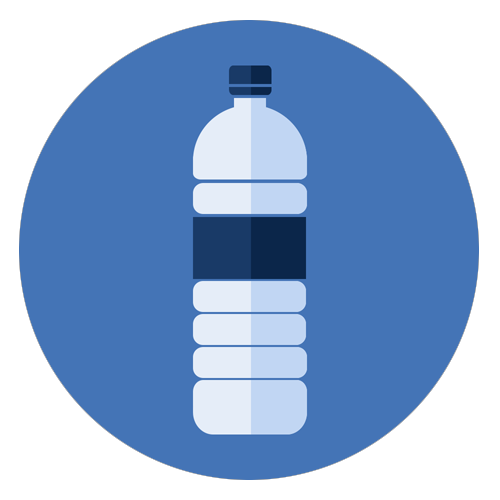

#  WaterTime

## Description

An OSX menu bar application in order to increase efficiency of day to day water drinking. The app allows the user to set their own waterbottle capacity to track total water consumption and a frequency interval to recieve push notifications, interrupting the user and reminding them to drink water.

## Motivation

Why water? As your brain is mostly water, consistently drinking it throughout the day has been shown to improve concentration and cognition; maintain memory function; increase energy; improve mood; prevent and relieve headaches; and reduce stress.
